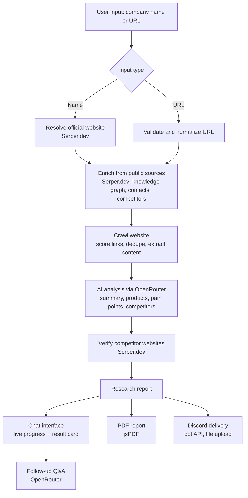
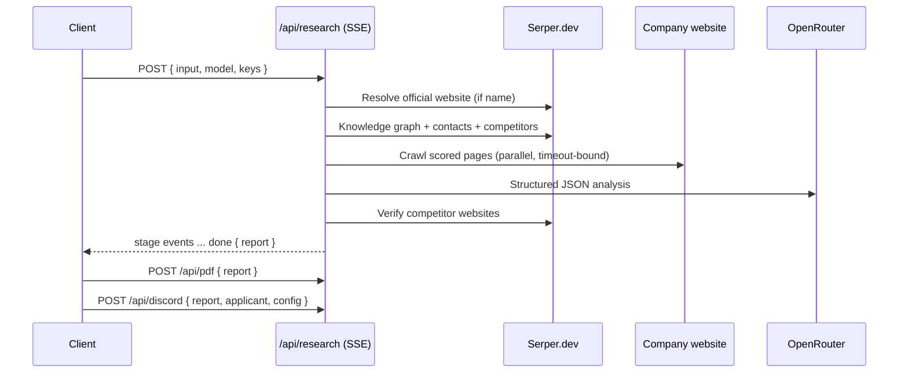

# Company Research Assistant

An AI-powered company research application. Provide a company name or website URL and receive a structured intelligence report: company profile, products and services, AI-generated pain points, competitor analysis, and a professionally formatted PDF — all through a ChatGPT-style conversational interface.

**Live deployment:** https://company-research-assistant-ecru.vercel.app/

Built for the Relu Consultancy AI & Automation Developer hiring challenge.

---

## Table of Contents

- [Overview](#overview)
- [Features](#features)
- [Architecture](#architecture)
- [Technology Stack](#technology-stack)
- [Getting Started](#getting-started)
- [Environment Variables](#environment-variables)
- [Deployment](#deployment)
- [API Reference](#api-reference)
- [Discord Integration](#discord-integration)
- [Project Structure](#project-structure)
- [Engineering Notes](#engineering-notes)
- [License](#license)

## Overview

The application accepts two input methods:

| Input | Example | Behavior |
| --- | --- | --- |
| Company name | `Stripe`, `Tesla`, `Microsoft` | Resolves the official website via Serper.dev, then researches it |
| Website URL | `https://stripe.com`, `figma.com` | Researches the given site directly |

The research pipeline searches public sources, crawls the company's website, analyzes the combined material with an AI model of the user's choice (via OpenRouter), verifies competitor websites, and renders the result as an interactive report with a downloadable PDF. After a report is generated, the interface switches to follow-up mode, allowing conversational questions about the researched company.

## Features

### Core

- **Dual input support** — company names are resolved to their official website using Serper.dev search and knowledge-graph signals before research begins.
- **Website crawler** — discovers and prioritizes important pages (Home, About, Products, Services, Solutions, Contact, Pricing) using keyword-scored link analysis; deduplicates URLs, skips login and irrelevant pages, and extracts clean text for AI analysis.
- **Search integration** — Serper.dev is used at four distinct points: official-website resolution, company information enrichment (phone, address), contact discovery, and competitor verification.
- **AI analysis** — OpenRouter generates the company summary, products and services, pain points, and competitor suggestions as validated structured JSON. Any OpenRouter-supported model can be selected from a live model list.
- **Competitor analysis** — each suggested competitor is displayed with its name, verified website, and a short rationale.
- **PDF report** — a single click produces a professionally formatted PDF containing all company information, pain points, competitors, and source references.
- **ChatGPT-style interface** — chat conversation flow, live per-stage progress timeline, responsive layout for mobile and desktop.

### Bonus

- **Discord integration** — a dedicated settings section accepts a Discord Bot Token, Channel ID, and applicant details. After each successful report, the application automatically posts the applicant details, company name, company website, and the generated PDF to the configured channel.
- **AI model selection** — the sidebar model selector is populated live from the OpenRouter model catalogue.
- **Follow-up chat** — after research completes, users can ask free-form questions about the company, answered from the gathered context.
- **Additional enhancements** — streaming progress indicators, source citations, in-memory result caching, graceful degradation when a site blocks crawling, SSRF-guarded crawling, and request-level API key override.

## Architecture

The application is a single unified Next.js project: the React frontend and all server-side integrations (Serper, crawler, OpenRouter, PDF, Discord) live in one codebase and deploy as one unit.



Each pipeline stage emits a Server-Sent Event, which the interface renders as a live progress timeline.



## Technology Stack

| Layer | Technology | Rationale |
| --- | --- | --- |
| Framework | Next.js 16 (App Router, TypeScript) | Single unified project; typed end to end |
| Styling | Tailwind CSS v4 | Fast, consistent design-token-driven UI |
| Crawling | `fetch` + `cheerio` | Lightweight and serverless-compatible; no headless browser required |
| Search | Serper.dev REST API | Required integration; search, knowledge graph, verification |
| AI | OpenRouter (OpenAI-compatible API) | Required integration; model-agnostic with live model list |
| PDF | jsPDF (server-side) | Deterministic, dependency-light report generation |
| Messaging | Discord REST API v10 | Direct multipart upload; no SDK dependency |
| Streaming | Server-Sent Events | Live progress without websockets |

## Getting Started

### Prerequisites

- Node.js 20 or later
- npm
- API keys for [OpenRouter](https://openrouter.ai/keys) and [Serper.dev](https://serper.dev)

### Installation

```bash
git clone https://github.com/Paaarthiv/Company-Research-Assistant.git
cd Company-Research-Assistant
npm install
```

### Configuration

Copy the environment template and add your keys:

```bash
cp .env.example .env.local
```

Alternatively, keys can be entered directly in the application sidebar at runtime; sidebar values take precedence over environment variables for each request.

### Run

```bash
npm run dev        # development, http://localhost:3000
npm run build      # production build
npm start          # serve production build
```

## Environment Variables

All variables are optional if keys are supplied through the sidebar UI instead.

| Variable | Purpose |
| --- | --- |
| `OPENROUTER_API_KEY` | Default OpenRouter key for AI processing |
| `SERPER_API_KEY` | Default Serper.dev key for search and research |
| `DISCORD_BOT_TOKEN` | Default Discord bot token for report delivery (bonus feature) |
| `DISCORD_CHANNEL_ID` | Default Discord channel for report delivery (bonus feature) |

Secrets are read server-side only and are never exposed to the client. The `/api/config` endpoint reports only boolean configuration status.

## Deployment

The project deploys as a single unit to Vercel (or any platform supporting Next.js).

1. Push the repository to GitHub.
2. Import the repository at [vercel.com/new](https://vercel.com/new); the framework is detected automatically.
3. Add the environment variables listed above under Project Settings.
4. Deploy.

The research and chat routes declare `maxDuration = 60` to accommodate crawl and inference time within serverless limits.

## API Reference

| Endpoint | Method | Description |
| --- | --- | --- |
| `/api/research` | POST | Runs the full research pipeline; streams stage events and the final report as Server-Sent Events |
| `/api/models` | POST | Returns the OpenRouter model catalogue for the model selector |
| `/api/chat` | POST | Answers follow-up questions about a completed report |
| `/api/pdf` | POST | Generates the PDF report from a report payload |
| `/api/discord` | POST | Sends the report PDF and applicant details to a Discord channel |
| `/api/config` | GET | Reports which integrations are configured server-side (booleans only) |

## Discord Integration

1. Create an application and bot at the [Discord Developer Portal](https://discord.com/developers/applications) and copy the bot token.
2. Invite the bot to a server with the "Send Messages" and "Attach Files" permissions.
3. Enable Developer Mode in Discord and copy the target channel's ID.
4. In the application sidebar, open the Discord tab, enter the bot token, channel ID, applicant name, and applicant email, then save.
5. After the next report is generated, the application automatically posts the applicant details, company name, company website, and the PDF report to the channel.

Evaluator-provided credentials entered in the sidebar always take precedence over any server-side defaults.

## Project Structure

```
src/
├── app/
│   ├── page.tsx                 Chat interface and client-side orchestration
│   ├── layout.tsx               Root layout, fonts, metadata
│   ├── globals.css              Design tokens and shared styles
│   └── api/
│       ├── research/route.ts    SSE research pipeline orchestrator
│       ├── models/route.ts      OpenRouter model catalogue proxy
│       ├── chat/route.ts        Follow-up question answering
│       ├── pdf/route.ts         PDF report generation
│       ├── discord/route.ts     Discord report delivery
│       └── config/route.ts      Server configuration status (booleans)
├── components/
│   ├── Sidebar.tsx              API keys, model selection, Discord settings
│   ├── ProgressTimeline.tsx     Live research progress indicator
│   ├── ResearchCard.tsx         Report presentation
│   └── Icons.tsx                Inline icon set
└── lib/
    ├── serper.ts                Search, website resolution, verification
    ├── crawler.ts               Page discovery, scoring, extraction, SSRF guard
    ├── openrouter.ts            Model list, structured analysis, follow-up chat
    ├── pdf.ts                   Report PDF layout
    ├── discord.ts               Discord REST multipart delivery
    ├── keys.ts                  Key resolution (request override then env)
    ├── types.ts                 Shared data models
    └── useLocalStorage.ts       Client-side configuration persistence
```

## Engineering Notes

- **Robustness.** Malformed AI output is repaired and retried on a fallback model; sites that block crawling degrade gracefully to search-based research with a visible notice; every page fetch is timeout-bound; competitor websites suggested by the model are independently verified through search.
- **Security.** The crawler validates every target against an SSRF guard (public http/https hosts only; loopback, private ranges, link-local, and cloud-metadata addresses are rejected). User input is length-capped. Server-held secrets are never returned to the client.
- **Performance.** Important pages are crawled in parallel with per-page timeouts and content caps; repeated queries in a session are served from an in-memory cache; extracted content is trimmed to keep model latency and cost predictable.
- **No persistence.** In line with the assignment constraints, the application requires no database, authentication, or user accounts; nothing is stored server-side between requests.

## License

This project is licensed under the MIT License. See [LICENSE](LICENSE) for details.
